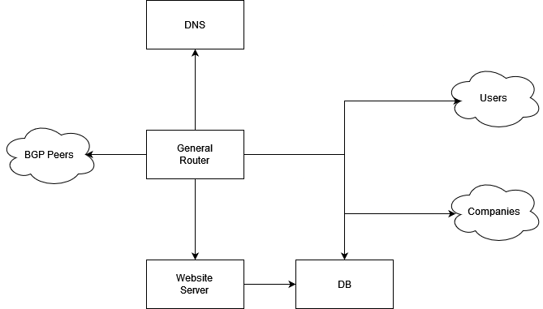

## The Topology

Each service is hosted on its own machine. The heart of the infrastructure is the "general server".

## IP addresses

The IP addresses are allocated in the ISP net as follows:
* genserver:
    - 10.206.0.1 in the client segment
    - 10.10.10.206 in the BGP network
    - 10.20.0.1 in the internal network
* DB:
    - 10.20.0.2 in the internal network
* DNS:
    - 10.206.206.206 in the client segment
* Website:
    - 10.20.0.3 in the inernal network
    - 10.206.0.2 in the client network

## Terminology

For more convinient scripting, the interfaces are renamed as follows:

| Node | Default Name | New Name |
| --- | --- | --- |
| genserver | eth0 | global |
| Website | eth0 | global |
| DNS | eth0 | global |
| genserver | eth1 | dbcom |
| DB | eth0 | gen |
| DB | eth1 | sitecom |
| Website | eth1 | dbcom |
| genserver | eth3 | usrcom |
| genserver | eth2 | bgpcom |